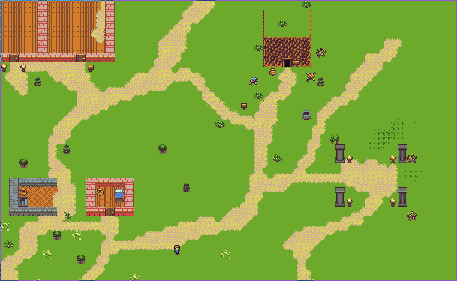

# realm.one


Realm one is an open source tile based game written in Rust using the Amethyst game engine. It is the first game that will be integrated into the distributed MMO platform [Worlds](https://github.com/Machine-Hum/Worlds). Following the implementation anyone will be able to fork this repository and add to the universe!

## Contribution
The project is under heavy development and we are always looking for people to help out! Please see the CONTRIBUTING document for development information. Join us on IRC! (#realm.one on Freenode), we also have a [Discord server]( https://discord.gg/ghJSrJk)!

### Tiles
Tiles are taken from [here](https://opengameart.org/content/tiny-16-basic?page=1) credit to Lanea Zimmerman! Tiles are arranged using the [Tiled Map Editor](https://www.mapeditor.org/).

## Running
You need to configure either metal or vulkan. This is shown in the cargo.Toml file.

### Client

```bash
git clone https://github.com/Machine-Hum/realm.one
cd realm.one
```

Setup the config file resources/config.ron, public server is **18.223.212.117:3457** right now 
```
AppConfig(
    server_ip: "18.220.126.218:3457",
    client_ip: "Depricated, Can be blank",
    player_name: "YourName - Change this!",
)
```

```bash
cargo run --release client 
```

### Server 

```bash
git clone https://github.com/Machine-Hum/realm.one
cd realm.one
```

Setup the config file resources/config.ron 
```
AppConfig(
    server_ip: "YourIP",
    client_ip: "",
    player_name: "",
)
```

```bash
cargo run --release server
```

## Gameplay
Once connected, you can move your character around with 'wasd' controls. There is also a command system that allows configuration of your character. To get into this command system press the '/' key, you can you freely type. Once you have finished your command press enter.

### Command listing
Commands are of the form: cmd arg subargs

```
cmd outfit male    // Change char to male
cmd outfit female  // Change char to female
cmd outfit nude    // Change char nude androgynous person 
```

Other outfits: bat, skeleton, slime, ghost, spider

## Hitlist (In order)
* [x] [Network Refactor](features/F005/)
* [x] [IO Refactor](features/F006/)
* [ ] [Monster AI](features/F001/)
* [ ] [Move Up/Down Stairs](features/F004/)
* [x] [Player UID](features/F002/)
* [ ] Spritesheet should be modified to allow melee in all directions
* [ ] [Blood Splat during combat](features/F003/)
* [ ] Should be able to open and close doors
* [ ] Other player should animate (Walking and melee)
* [ ] Controls are clunky
* [ ] Serverside database
* [ ] Proper player authentication
* [ ] Build more maps
* [ ] lil guy should have a health bar (Zelda Style hearts)
* [ ] Gameplay ideas
* [ ] A story lol
